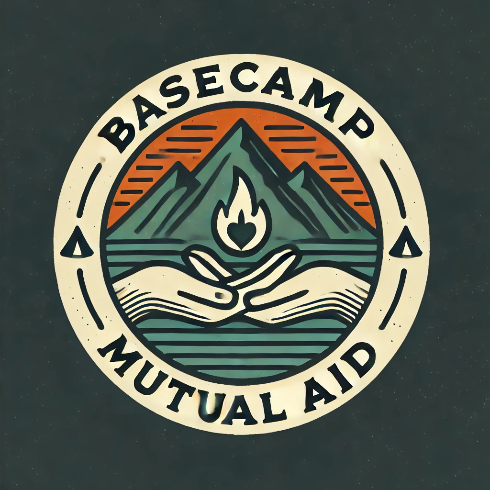

# Basecamp Mutual Aid

**EIN:**  
12-3456789

**Registered State:**  
Colorado

**501(c)(3) Status:**  
Verified nonprofit organization

---

## Our Approach to Privacy

- No personal data or contact information collected  
- No online donations or grants  
- No digital forms  

> “We operate offline, in person, and without data collection.”

---

## Donations and Grants

- Donations and grants are initiated in person, never online.  
- Grants are securely processed through trusted payment service providers. These processors may require personally identifiable information as part of the transaction. This information is never shared with us.  
- Donations can be made using major credit and debit cards, Apple Pay, Link, Cash App Pay, or Amazon Pay. We do not accept Google Pay due to privacy concerns.
- All payments are processed by a trusted and familiar payment service provider. 

---

## Donation Questions?

If there's an issue with your donation, bring it up to your local volunteer. They'll make it right.

---

## Why This Site Exists

This site exists to meet payment service provider requirements.

---

## Required Disclosures 

**Contact:**  
All donor questions are handled in person by local volunteers.  
For partner compliance questions, email: [contact@basecamp-mutual-aid.org](mailto:contact@basecamp-mutual-aid.org)

**Refund & Cancellation Policy:**  
We do not sell physical goods or services. Donations are voluntary, handled in person, and there are no recurring donations.

**Export Restrictions, Promotions, or Terms:**  
Not applicable.

